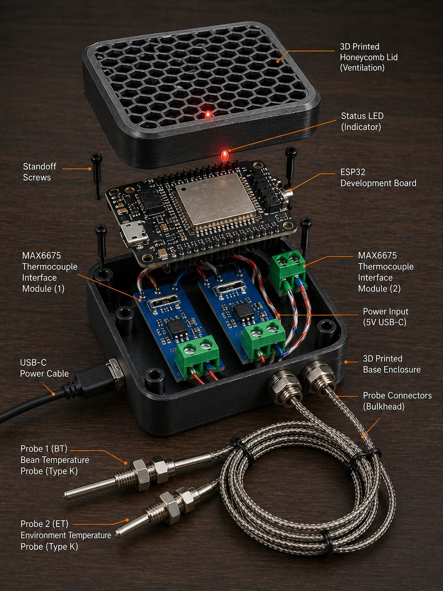

# RoastIQ

Open-source coffee roasting telemetry. Stream real-time Bean Temperature (BT) and Exhaust Temperature (ET) from an ESP32 to Artisan Scope.



---

## Get Started

Three steps to get your roaster connected:

### 1. Flash the ESP32

Install the firmware on your ESP32 using PlatformIO:

```bash
pip install platformio
pio run -e dev --target upload --upload-port /dev/ttyUSB0
pio device monitor --port /dev/ttyUSB0 --baud 115200
```

The ESP32 creates a WiFi network named **RoastIQ**. Note the IP address (e.g. `192.168.4.1`).

### 2. Wire the Thermocouples

Connect two MAX6675 modules to the ESP32:

| Component | GPIO |
|-----------|------|
| BT CLK / CS / DO | 5 / 23 / 19 |
| ET CLK / CS / DO | 26 / 25 / 33 |

Full wiring: [Getting Started](docs/getting-started.html)

### 3. Connect to Artisan

1. Open **Artisan → Config → Device**
2. Set ET/BT device to **WebSocket**
3. Enter URL: `ws://192.168.4.1/ws`
4. Press **ON**

BT and ET curves appear at 4 Hz.

---

## Downloads

Download the firmware and circuit documentation:

| File | Description |
|------|-------------|
| [main.cpp](https://raw.githubusercontent.com/rORrEtboLt/esp32_temp/master/src/main.cpp) | ESP32 firmware |
| [temperature.h](https://raw.githubusercontent.com/rORrEtboLt/esp32_temp/master/include/temperature.h) | Temperature validation + rolling average |
| [telemetry.h](https://raw.githubusercontent.com/rORrEtboLt/esp32_temp/master/include/telemetry.h) | WebSocket JSON frame builder |
| [platformio.ini](https://raw.githubusercontent.com/rORrEtboLt/esp32_temp/master/platformio.ini) | Build configuration |
| [CIRCUIT.md](https://raw.githubusercontent.com/rORrEtboLt/esp32_temp/master/CIRCUIT.md) | Wiring diagram |

---

## Features

- **4 Hz sampling** — Bean Temperature and Exhaust Temperature
- **Artisan compatible** — Direct WebSocket connection, no server required
- **Standalone operation** — ESP32 creates its own WiFi access point
- **Open source** — MIT licensed, full firmware available
- **Simple hardware** — Off-the-shelf MAX6675 thermocouple modules

---

## Documentation

- [Getting Started](docs/getting-started.html) — Quick start guide
- [Firmware Guide](docs/firmware-guide.html) — Build and customize the firmware
- [Artisan Guide](docs/artisan-guide.html) — Connect to Artisan Scope
- [Troubleshooting](docs/troubleshooting.html) — Fix common issues
- [Architecture](docs/architecture.html) — System design

---

## License

MIT License — free for commercial and personal use. See [LICENSE](LICENSE).